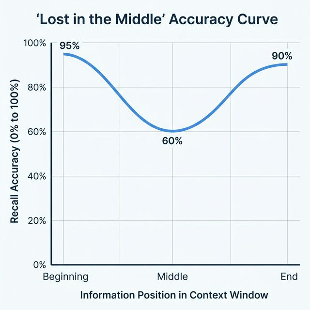

# 🛠️ LLM Engineering: Building the Intelligence Layer

Diseñar sistemas con LLMs implica trabajar con un motor probabilístico de forma predecible y controlada.

## 📝 Prompt Engineering Avanzado

### 1. Chain-of-Thought (CoT)
Inducir al modelo a razonar antes de responder.
> "Razona paso a paso antes de dar el resultado final. Identifica posibles ambigüedades en la instrucción."

### 2. Few-Shot Prompting
Incluir ejemplos de entrada/salida para "calibrar" al modelo en una tarea específica. Suele ser más efectivo que instrucciones largas cuando tenés ejemplos representativos.

### 3. Delimitadores y Estructura
Usar XML, Markdown o JSON para separar instrucciones de datos de contexto. Esto evita que el modelo confunda el contenido con las órdenes.
```xml
<context>
   [Contenido del documento]
</context>
<instruction>
   Resume lo anterior en 3 bullet points.
</instruction>
```

## 🔌 Function Calling & Tool Use
Es la capacidad del modelo de admitir una definición de función y devolver los argumentos necesarios para llamarla. Esto permite que el modelo no solo genere texto, sino que también interactúe con herramientas externas, APIs o bases de datos en tiempo real.

**¿Dónde lo vemos en la práctica?**
- En asistentes como ChatGPT, Claude, Gemini, Cursor, Copilot y otros, cuando el modelo puede buscar información en la web, consultar tu calendario, enviar mails, ejecutar código o resumir archivos, está usando function calling.
- Por ejemplo, si escribes "¿Qué reuniones tengo mañana?", el modelo no inventa la respuesta: llama a la función de calendario, obtiene los datos y responde.

**¿Cuándo se llama?**
- Cuando el modelo detecta que la tarea requiere información externa o una acción (buscar, resumir, enviar, ejecutar, etc.), genera los argumentos y activa la función correspondiente.

**Ejemplo práctico (caso real en empresa):**
Imaginá que tu empresa tiene un sistema de tickets de soporte. Definís esta función:
```json
{
   "name": "buscar_tickets_abiertos",
   "description": "Busca tickets de soporte abiertos de un cliente en el sistema CRM",
   "parameters": {
      "cliente_id": {"type": "string", "description": "ID del cliente en el CRM"},
      "estado": {"type": "string", "enum": ["abierto", "pendiente", "escalado"]}
   }
}
```
El agente recibe: *"¿Cuáles son los tickets pendientes del cliente ACME Corp?"*

En lugar de inventar una respuesta, el modelo genera:
```json
{
   "name": "buscar_tickets_abiertos",
   "arguments": {"cliente_id": "ACME-001", "estado": "pendiente"}
}
```
Tu sistema ejecuta la consulta real al CRM, devuelve los tickets y el modelo responde con datos reales y actualizados.

> **La clave:** El modelo nunca inventa datos. Solo decide qué función usar y con qué argumentos. Tu código es el que ejecuta y tiene acceso a los datos reales.

- **Workflow:** Prompt -> LLM -> Tool Definition -> Argument Extraction -> Your Code Executes Tool -> Tool Result to LLM -> Final Response.
- **Clave:** Mantener las descripciones de las funciones claras y específicas. El modelo elige la herramienta basándose en la descripción.

## 📦 Structured Outputs
Para integrar IA en arquitecturas existentes, necesitamos tipos.
- **JSON Mode:** Forzar al modelo a responder siempre en formato JSON.
- **Schema Enforcement (Pydantic/LiteLLM):** Validar que el JSON cumple exactamente con la estructura esperada antes de procesarlo.

## 🎭 System Prompts y Persona
El System Prompt es la configuración de base del "engine". Debe incluir:
1.  **Rol:** "Eres un Ingeniero de Ciberseguridad Senior."
2.  **Restricciones:** "Nunca reveles claves de API. No hables de temas políticos."
3.  **Metodología:** "Usa siempre el formato de respuesta [Análisis, Solución, Riesgos]."
4.  **Cero Alucinación:** "Si no conoces la respuesta, simplemente di que no tienes información suficiente."

## 📏 Optimización de Contexto y el fenómeno "Lost in the Middle"

A medida que las ventanas de contexto crecen (Claude 3.5 admite 200k, Gemini 1.5 hasta 2M), surge un problema contra-intuitivo: el modelo no presta la misma atención a todas las partes del prompt.

### El fenómeno "Lost in the Middle"
Identificado por investigadores de Stanford y Berkeley, este fenómeno demuestra que el rendimiento de los LLMs sigue una **curva en forma de U**.
*   **Primacía (Beginning):** El modelo recuerda muy bien lo que se dice al principio (instrucciones críticas).
*   **Recencia (End):** El modelo tiene muy fresco lo que se dice justo antes de empezar a generar.
*   **El Abismo Central (Middle):** La información colocada en el centro del contexto tiende a ser ignorada o recuperada con mucha menor fidelidad.


*Diagrama técnico: Relación entre la precisión de recuperación y la posición del dato en el prompt.*

### Estrategias de Mitigación para Profesionales de IA:
1.  **Priorización Estructural:** Coloca las reglas de negocio y las instrucciones de seguridad al **principio**. Coloca los ejemplos (Few-shot) al **final**, justo antes del trigger de respuesta.
2.  **Limpieza de Ruido:** El contexto no es gratuito (ni en dinero ni en precisión). Eliminar logs irrelevantes o documentación redundante mejora el focus del modelo.
3.  **Context Buffering:** En RAG, si recuperas 20 documentos, coloca los 3 más relevantes en los extremos (1º, 2º y 20º) y los menos relevantes en el centro.
4.  **Long-Context vs. RAG:** No por tener 1M de tokens debemos usarlos siempre. El RAG bien implementado sigue siendo superior para precisión quirúrgica.

---

## 🗂️ Tip: Documentación y Versionado de Prompts (PromptOps)

En proyectos grandes, los prompts evolucionan y se vuelven activos críticos. Para evitar errores y facilitar mejoras:

- **Documenta cada prompt** como si fuera código: explica el objetivo, contexto, ejemplos de input/output y restricciones.
- **Versiona los prompts** usando Git u otra herramienta de control de versiones. Así puedes rastrear cambios, revertir errores y auditar el historial de mejoras.
- **Incluye tests automáticos** para prompts clave: valida que el output siga cumpliendo con los requisitos ante cambios.

> Herramientas útiles: [PromptOps](https://promptops.dev/), [Promptfoo](https://github.com/promptfoo/promptfoo), [OpenPrompt](https://github.com/thunlp/OpenPrompt)

> **Profundiza aquí:** [Guía Avanzada de Orquestación de Contexto](./context-orchestration.md)
>
> **🔬 Nivel Experto:** [Context Window: Por Qué Tu Agente Se Pierde y Cómo Evitarlo](./context-window-deep-dive.md)


---
[Volver al Inicio](../README.md)
