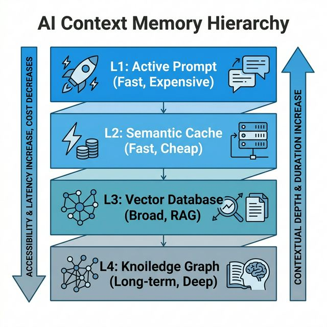

# 🎼 Context Orchestration: Cómo Administrar La RAM de Tu Agente

Si el prompt es el código, la orquestación del contexto es la gestión de memoria del sistema. No se trata de "pasar más datos", sino de **curar, cachear y segmentar** lo que el agente recibe.

## 🏗️ El Contexto como Jerarquía de Memoria

El error más común es tratar el contexto como un bloque estático de texto. Una arquitectura efectiva tiene niveles:

*   **L1 (Active Context):** Lo que está en el prompt ahora. Tokens caros, alta atención.
*   **L2 (Semantic Cache):** Respuestas previas almacenadas por similitud vectorial. Si alguien preguntó algo parecido, no hace falta llamar al LLM de nuevo.
*   **L3 (Vector DB / RAG):** Documentación y base de conocimientos externa. El agente la consulta bajo demanda.
*   **L4 (Long-term Memory):** Historial completo summarizado o persistido en Knowledge Graphs. Los artifacts de BMAD viven acá.

> **Ejemplo Práctico:** [Semantic Cache conceptual en Python](./examples/semantic_cache_example.py) — cómo evitar llamadas duplicadas al LLM.

## ⚡ Estrategias de Optimización

### 1. Prompt Caching
Disponible en Claude y GPT-4o. Permite reutilizar los cálculos de atención de las partes estáticas del prompt.
*   **Patrón:** La parte que no cambia (System Prompt, CLAUDE.md, schema de salida) va al inicio y se marca como cacheable.
*   **Impacto:** Hasta **90% menos en costes** y **80% menos en TTFT** (Time to First Token).
*   **Regla:** Solo cachear lo que vas a reutilizar en múltiples llamadas. El `CLAUDE.md` de un proyecto es el candidato perfecto.

### 2. Semantic Caching
Una capa a nivel de aplicación que intercepta queries antes de que lleguen al LLM:
*   **Workflow:** User Query → Embedding → Vector Search → ¿Similitud > 0.95? → Devolver respuesta cacheada.
*   **Resultado:** Respuesta instantánea (ms) y coste cero de API.

### 3. Context Pruning & Dynamic Windows
No toda la conversación es relevante para el paso actual.
*   **Sliding Window:** Mantener solo los últimos N mensajes.
*   **Summarized Context:** Comprimir mensajes antiguos en un resumen que consume 10x menos tokens.
*   **Importance Scoring:** Usar un modelo pequeño (Llama 3 8B, Phi-3) para puntuar qué fragmentos del RAG son realmente necesarios antes de inyectarlos en el modelo principal.

## 🧩 Patrones de Orquestación

| Patrón | Funcionamiento | Cuándo usarlo |
| :--- | :--- | :--- |
| **Context Splitting** | Dividir la tarea entre agentes especializados. Cada uno recibe solo el contexto necesario. | Tareas complejas con muchos documentos (BMAD hace esto naturalmente). |
| **Skeleton-of-Thought** | El modelo genera primero un índice/estructura y luego expande cada punto en llamadas paralelas. | Respuestas largas que necesitan consistencia interna. |
| **Context Paging** | El agente "pagina" a través de un documento largo usando herramientas de lectura bajo demanda. | Cuando el dataset supera la ventana disponible. |

## 🛡️ Guardrails en la Orquestación
No permitas que el contexto crezca sin control. Contexto inflado = piso de ruido alto = ataques de **Prompt Injection** más fáciles:
*   **Enforce Structure:** Usar delimitadores XML para que el modelo distinga entre la orquestación y los datos del usuario.
*   **Token Budgeting:** Asignar presupuestos de tokens por usuario/sesión para evitar costes imprevistos.

---
[Volver a LLM Engineering](./README.md) | [Volver al Inicio](../README.md)
